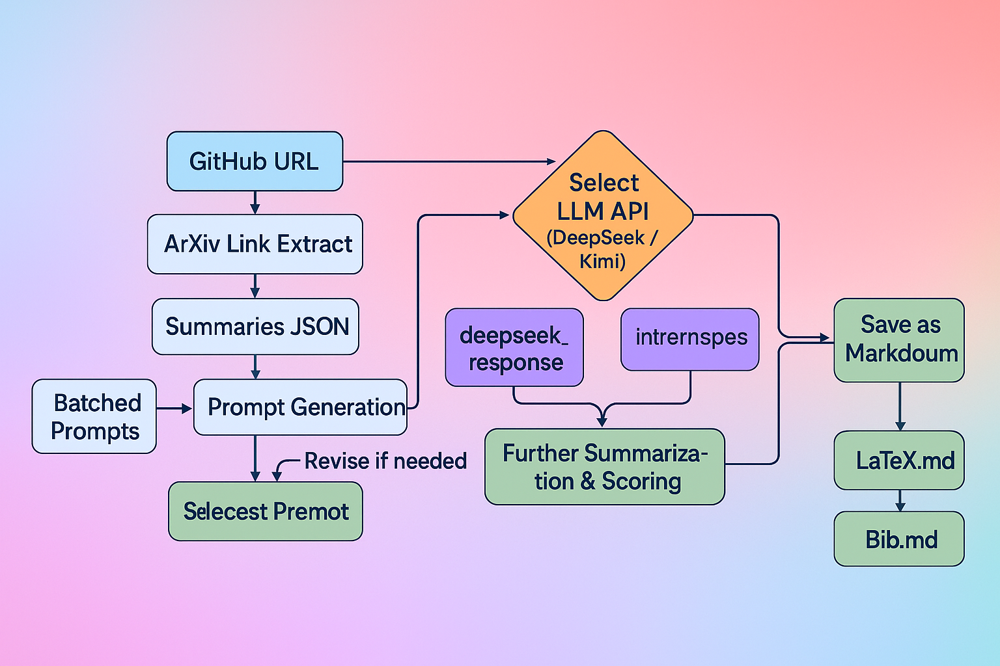
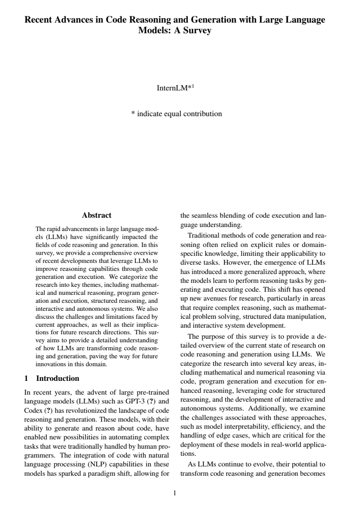

# Survey Agent

 

An open-source pipeline built on the Lagent that automatically scans arXiv paper links, and uses LLM to generate **abstracts, tables of contents, quality scores, and iterative rewrites**, ultimately exporting survey text and BibTeX citations in LaTeX format. The reference demo collected and learned **68 papers** in less than six minutes, greatly reducing researchers’ manual curation time.

## Pipline

(Created by ChatGPT o3)

## Key Results

